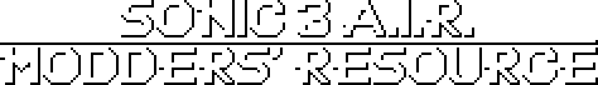

<!-- Ideally, we'd be able to just scale the normal image by 5 here, but image auto-smoothing makes it look rather bad when we do that so we gotta use this pre-scaled version instead -->

___

The Modders' Resource is a free, public, non-commercial resource library created _by_ modders _for_ modders. Every asset available in this public repository can be used for any purpose non-commercially, without the need of crediting or asking for permission.

**Looking to contribute? [Read our Contributor Guidelines](https://github.com/Sonic-3-AIR-Modders-Board/3AIR-Mod-Resources/blob/main/docs/CONTRIBUTING.md)!**

### Usage Guidelines

As stated, the assets are free to use for public open usage. The only exemptions would be commercial usage and direct reuploads.

*Commercial usage* occurs when the usage of assets are for profit in real world currency or any digital item/currency that can be turned into real world currency (for example, Bitcoin.) This includes paid-access, paywalled, or commissioned content (for example, as a Patreon reward for paid tiers.)

An example of non-commercial, commissioned usage would be [Gamebanana](https://gamebanana.com/) points from requests. The only thing you could really turn them into are games.

_______________

*Direct reuploads* occur when assets are reuploaded without changes or are not part of a bigger project/mod/asset. The exemption to this guideline is if you are using an asset for educational purposes (for example, if you are making a tutorial) in which case we are fine with that.

An example of direct reuploads would be using a script file from the Modders' Resource within a mod without any other additional assets (such as other script, sprites, audio, etc.) and the script itself remains unchanged.

If you are looking to share our assets with others for any reason, we recommend sending them over to the Modders' Resource using the repository link, https://github.com/Sonic-3-AIR-Modders-Board/3AIR-Mod-Resources.

### Index

> [Documentation](https://github.com/Sonic-3-AIR-Modders-Board/3AIR-Mod-Resources/tree/main/documentation/) - Articles that contain documentation about various aspects of moddind.
>
> [Mods](https://github.com/Sonic-3-AIR-Modders-Board/3AIR-Mod-Resources/tree/main/mods) - Mods to base your own creations off of; such as making new monitors.
>
> [Scripts](https://github.com/Sonic-3-AIR-Modders-Board/3AIR-Mod-Resources/tree/main/scripts) - Pre-made scripts ready for actioon. Whether that would be forcing smoooth rotation, or adding new abilitys.
>
> [Sprites](https://github.com/Sonic-3-AIR-Modders-Board/3AIR-Mod-Resources/tree/main/sprites/hud) - Brand new sprites fully hand-crafted for your usage in mods.

### More Information

Please see the [wiki](https://github.com/Sonic-3-AIR-Modders-Board/3AIR-Mod-Resources/wiki) for more information on the Modders' Resource.

This repository and its content are not licensed under any license but may be used as stated.
